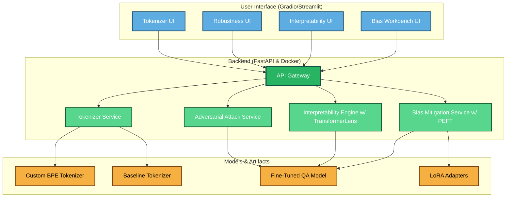

# **Project IshVaani (ईशवाणी)**

### **An Interpretability, Robustness, and Safety Toolkit for Hindi Language Models**

**Project Status:** **In Progress (Planning & Phase 1 Development)** 

**Author:** Shilpa Musale (Ishi)

## **1\. Vision: Listening to the Voice of AI**

Large Language Models are becoming increasingly powerful, yet they remain complex, opaque systems. Their inner workings, especially in non-English languages like Hindi, are not well understood. **Project IshVaani** is a research and engineering initiative to build a comprehensive open-source toolkit designed to interpret, stress-test, and steer the behavior of Hindi and "Hinglish" (code-switched) language models.

This project moves beyond simply using models and aims to provide the tools to **deeply understand them**, aligning directly with the core AI safety and research missions of top labs focused on building reliable, interpretable, and steerable AI systems.

## **2\. The Challenge: The Nuances of Hindi & Hinglish**

Standard LLMs often fail to capture the rich, complex structure of Hindi and the fluid, code-switched nature of Hinglish. This leads to subtle but significant issues in performance, reliability, and fairness. Key challenges include:

* **Inefficient Tokenization:** Standard multilingual tokenizers can be wasteful and linguistically naive for Devanagari script.  
* **Code-Switching Failures:** Models often struggle when English and Hindi are mixed within the same sentence, a common real-world scenario.  
* **Hidden Biases:** Models trained on broad web data can perpetuate and amplify cultural, regional, and gender biases present in the training corpus.  
* **Lack of Interpretability:** It is incredibly difficult to understand *why* a model made a specific decision, especially when dealing with complex linguistic phenomena.

## **3\. The Solution: A Two-Phase Approach**

This project is structured in two distinct but connected phases: foundational research followed by productization.

#### **Phase 1: The Tokenizer Bake-Off (Foundational Research)**

Before we can analyze a model, we must ensure its foundations are solid. This phase involves a rigorous comparative analysis between a standard multilingual tokenizer and a custom-trained Hindi-English BPE tokenizer. We will fine-tune a model with each and measure the downstream impact on performance, efficiency, and the ability to handle Hinglish.

#### **Phase 2: Project IshVaani (The Toolkit)**

The core of the project is to build an interactive web application that serves as a comprehensive "lens" into Hindi NLP models. This toolkit will provide a suite of advanced features for researchers and developers.

## 4. Features

The final **IshVaani toolkit** will be a deployed web application featuring four key modules:

| Feature                       | Description                                                                                                                                       | Core Skill Demonstrated                  |
|-------------------------------|---------------------------------------------------------------------------------------------------------------------------------------------------|------------------------------------------|
| Interactive Tokenizer Visualizer | A side-by-side comparison tool to visualize how different tokenizers split Hindi and Hinglish text, productizing the findings from Phase 1.       | Foundational NLP Systems Engineering      |
| Adversarial Robustness Suite  | A suite of tools to automatically generate linguistically-aware adversarial attacks (e.g., synonym swapping, romanization) to probe for weaknesses. | AI Robustness & Reliability Testing       |
| Mechanistic Interpretability Lab | An advanced toolkit using TransformerLens to visualize attention patterns and trace model decisions back to specific neurons and attention heads.  | Deep Model Analysis & Research Mindset    |
| Bias Steering Workbench       | A closed-loop system to diagnose a specific bias (e.g., gender bias), mitigate it with targeted fine-tuning (LoRA), and verify the reduction.      | AI Safety & Steerable AI Systems          |

## **5\. Technical Architecture**

The project will be built using a modern MLOps stack, designed for robustness, scalability, and reproducibility.

## **6\. Project Status & Roadmap**

This project is currently in the initial development phase.

* InProgress  
  Phase 1: Foundational Research (Weeks 1-4)  
* Upcoming  
  Phase 2: Toolkit Development (Weeks 5-11)  
* **Target Completion:** November 2025

## **7\. Getting Started**

*(This section will be updated with setup and installation instructions once the toolkit is ready for its initial release.)*

\# Clone the repository (coming soon)  
git clone \[https://github.com/shilpamusale/ish-vaani.git\](https://github.com/shilpamusale/ish-vaani.git)  

cd ishvaani

\# Install dependencies (coming soon)  
pip install \-r requirements.txt

\# Run the application (coming soon)  
docker-compose up \--build

